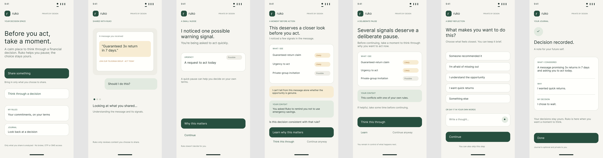

# Ruko: a pause between "I want to act" and "I acted"

Ruko is a decision-safety layer for Indian retail investors. It was built for the **SANGYAN
Investor Resilience Hackathon** (SNTC, IIT (BHU) Varanasi, with SEBI and NSDL).

- **Primary track:** D, Financial Habits & Behavioural Resilience.
- **Supporting tracks:** A, B, C and E, all inside the same single journey.



## The problem

Most retail investors don't get their ideas from research. They get them from a Telegram group,
a WhatsApp forward, a YouTube video or a friend. Two very different harms start from that same
message:

- **Real market, harmful habits.** Someone acts on a tip in F&O, intraday or an IPO. They often
  use borrowed or emergency money, act late at night, or try to win back a loss.
- **Fake market, fraud.** Someone is pulled into a "VIP group" and a fake trading app. They pay
  a stranger over UPI, then get asked for a "fee" to withdraw.

Warnings, courses and fraud lists already exist. What is missing is help **at the moment of the
decision**, in the person's own terms and language.

## What Ruko does

You share the message with Ruko: text, a link, a screenshot or a voice note, straight from
WhatsApp or Telegram. Ruko then does five things:

1. **Understands what you are trying to do.** It checks whether you are asking a question,
   checking a message, about to act, or have already paid. Each of these gets a different path.
2. **Shows what the message is doing.** It lists signals such as guaranteed-return claims,
   urgency, impersonation or a payment to a personal UPI ID. Each one quotes your message's own
   words and says how sure Ruko is. There is never a "scam / not scam" verdict.
3. **Shows what it means for *your* money.** The amount as a share of your savings, in months of
   your expenses, against **your own rules** ("never more than 10% of savings", "no borrowed
   money"). For leveraged products it shows what a 10%, 25% or 50% fall does to your money.
4. **Pauses in proportion.** Most decisions pass with one quiet line. Strong signals get a short
   pause, one reflection question and a cooling-off timer you set yourself. **"Continue anyway"
   is always there.** Ruko never blocks.
5. **Helps afterwards too.** If money has already gone, Ruko gives the urgent steps first (the
   1930 helpline, your bank, the National Cyber Crime Reporting Portal). It adds an evidence
   checklist and a complaint draft that you send yourself.

Around that journey:

- **Learn.** Short lessons are ordered for you, and every financial word in Ruko's text can be
  tapped for a one-line explanation.
- **Calculator.** SIP, goal, inflation, the effect of a fall and trading costs, always shown as
  arithmetic under stated assumptions.
- **Journal.** It stays on your phone and shows your own patterns over time.
- **Broker API.** A broker could call it before an order, without sending the stock or who the
  user is.

All of it works in **English, Hindi and Kannada**, with voice in and out.

**Ruko is not** an adviser, a tip rater, a trading tool or a "should I buy X?" chatbot. It never
says a tip, stock, scheme, app or person is good, bad, safe or legit.

### How it maps to the problem statement

| Track | Where it shows up in Ruko |
|---|---|
| **D. Financial Habits & Behavioural Resilience** (primary) | The pause itself: your own rules, borrowed or emergency money, a recent loss, frequent trading, a late-night decision, a cooling-off timer you set, a written decision plan, and a journal that shows your patterns |
| A. Digital Fraud & Scam Resilience | Fraud signals in text and screenshots, payment-destination checks, lookalike links (never opened), and the "I already paid" recovery path |
| B. Investor Awareness, Rights & Grievance Redressal | Recovery routes in the right order (1930, cyber-crime portal, bank, broker, SEBI SCORES, SMART ODR) and a ready complaint draft |
| C. Investor Education for Bharat | Lessons chosen for this decision, tap-to-explain words, calculators in your own rupees, three languages, voice |
| E. Misinformation & Financial Content Literacy | Signals grouped by what the message is doing to you (pushing you to act, making claims, where it comes from), each quoting the message's own words |

## How it works

```
   WhatsApp / Telegram / YouTube / a friend
                    │  share · paste · screenshot · voice
                    ▼
┌──────────────────────── Ruko backend (stateless) ─────────────────────────┐
│ 1. Read the input     text · link (never opened) · screenshot · voice     │
│ 2. Protect privacy    phone, UPI, account, card, PAN and names removed    │
│                       locally, before anything leaves the server          │
│ 3. Input gate         refuses "what should I buy" / "will it go up" /     │
│                       pasted OTPs and passwords, in three languages       │
│ 4. Decision stage     learn · check a message · about to act ·            │
│                       already paid · calculate · unclear                  │
│ 5. Understand         deterministic patterns first; the language model    │
│                       only fills structured fields from redacted text     │
│ 6. Safety engine      message signals + your own context → level L0–L3    │
│    (deterministic)    every threshold in one YAML file                    │
│ 7. Explain            at most 3 short cards or lessons, cited and dated   │
│ 8. Render + check     human-written templates only; every sentence passes │
│                       an assertion-level safety validator                 │
└───────────────────────────────────────────────────────────────────────────┘
                    │  typed response (level, reasons, numbers, text)
                    ▼
     React app (installable PWA): profile, rules and journal stay on the phone
```

**The language model never writes what you read.** The stage, the level, the reasons, every
number and every sentence come from tested code and human-written templates. The model only
turns messy input into structured fields. Ruko keeps working, more simply, if the model is down.

The full set of rules behind this is in [docs/principles.md](docs/principles.md).

## Run it

You need Python 3.11+ and Node 20+.

### Option 1: one server (the full product, closest to production)

```bash
python -m venv .venv
.venv/Scripts/python -m pip install -e ".[dev]"      # macOS/Linux: .venv/bin/python
cp .env.example .env                                 # optional: add a Gemini / Sarvam key

cd frontend && npm install && npm run build && cd ..
RUKO_STATIC_DIR=frontend/dist .venv/Scripts/python -m uvicorn ruko.main:app --port 8000
```

On PowerShell, set the variable first: `$env:RUKO_STATIC_DIR="frontend/dist"`.

Open http://localhost:8000 for the app or http://localhost:8000/docs for the interactive API.

### Option 2: two terminals (for development)

```bash
.venv/Scripts/python -m uvicorn ruko.main:app --port 8000     # terminal 1: backend
cd frontend && npm run dev                                    # terminal 2: http://localhost:5173
```

### Option 3: Docker

```bash
docker build -t ruko .
docker run --rm -p 8080:8080 -e PORT=8080 --env-file .env ruko
```

**No keys? It still runs.** Without a Gemini key, understanding falls back to the deterministic
patterns. Without a Sarvam key, the phone's own voice reads the text.

| Setting | Meaning |
|---|---|
| `RUKO_ENVIRONMENT` | `dev` or `prod`. Production hides every fact a human has not verified. |
| `RUKO_SHOW_UNVERIFIED_FACTS` | Overrides the above. The demo uses `true` so the draft lessons are visible. |
| `RUKO_GEMINI_API_KEY`, `RUKO_GEMINI_MODEL`, `RUKO_GEMINI_FALLBACK_MODEL` | Gemini for structured extraction and screenshot reading |
| `RUKO_SARVAM_API_KEY` | Sarvam for speech in Kannada, Hindi and English |
| `RUKO_STATIC_DIR` | Folder with the built web app. When set, the backend serves it at `/`. |

Steps for testing on an Android phone, including sharing from WhatsApp, are in
[frontend/README.md](frontend/README.md). A guided tour of every feature is in
[docs/demo_script.md](docs/demo_script.md). Deploying to Cloud Run is in
[docs/deploy_cloud_run.md](docs/deploy_cloud_run.md).

## Repository map

```
src/ruko/
  api/            HTTP routes (/v1/*), edge protections, serving the web app, share target
  orchestrator/   the analyze workflow: one tool executor with an allow-list
  understanding/  decision stage, signal patterns, links, payments, quotes, LLM extraction
  engine/         the deterministic safety engine: exposure, rules, levels
  guardrails/     input gate, sensitive-data check, assertion-level output validator
  language/       language detection, redaction, Indian number formats, templates
  cards/          just-in-time explanation cards and the glossary
  learn/          lessons, the Learn list, the tap-to-explain word layer
  tools/          calculators (pure functions, no I/O)
  recovery/       "I already paid": scenario, ordered steps, complaint draft
  journal/        the person's own patterns, computed per request and forgotten
  providers/      Gemini and Sarvam behind interfaces, plus offline fakes
  models/         every request and response as a typed Pydantic model

data/             everything a person reads, and every threshold, as reviewable YAML
  policy/         intervention levels, guardrails, output policy, tools, calculators
  templates/      every sentence Ruko can say, in en / hi / kn
  facts/          statistics, helplines and rules, each with source, date and verification flag
  lexicon/, stages/, learn/, glossary/, cards/, language/, prompts/

frontend/         React + TypeScript PWA (installable, share target, offline rules and journal)
tests/            unit, integration, golden end-to-end and guardrail suites
eval/             labelled evaluation sets and the harness that writes docs/eval_report.md
scripts/          smoke test of the whole product, data-source and translation-review exports
docs/             design documents (index below)
```

## Safety, tested

- **Guardrail suite: over 400 adversarial cases** in English, Hindi, Kannada, romanised and
  mixed text. Advice requests, predictions, role-play, prompt injection hidden in a tip, pasted
  OTPs. It must pass at 100%.
- **Assertion-level validator.** Ruko may say *"this message contains a guaranteed-return
  claim"*. It can never say *"this is guaranteed"* or *"this app is safe"*. It runs on every
  template in all three languages and again on every whole response.
- **The contracts make unsafe things unrepresentable.** "Continue anyway" is a constant `true`.
  There is no "certain" certainty label. The broker API has no field for a stock name or a
  user ID.
- **Property tests on the engine.** Adding a risk can never lower the level, and fraud patterns
  always reach the strongest pause.
- **Privacy tests.** A sentinel string sent in a request never appears in any log line. There
  are no key-like strings in the repository, and network code exists only in the provider
  modules.

```bash
.venv/Scripts/python -m pytest                     # about 1,200 backend tests, offline
cd frontend && npm test                            # about 240 frontend tests
.venv/Scripts/python scripts/smoke_test.py         # starts the real product, walks every journey
.venv/Scripts/python eval/run_eval.py              # rewrites docs/eval_report.md
```

## Privacy

- **The profile, rules, plans and journal live on the phone.** They travel with each request
  and the server forgets them. The server stores nothing and logs only allow-listed fields:
  route, status, timings, stage and codes.
- **Personal details are removed before any external call.** Screenshots and voice notes are the
  exception, because they cannot be redacted before they are read. They are processed in
  memory only.
- **Links are never opened.** Ruko never sends a message for you and never touches money.

## Honest limitations

- **Facts.** The group statistics, recovery routes and regulatory facts have been checked
  against their sources. The lesson and glossary texts are still marked unverified, so
  production hides them until someone reviews them. The demo runs with
  `RUKO_SHOW_UNVERIFIED_FACTS=true`.
- **Hindi and Kannada** text, patterns and lessons are drafts awaiting a native-speaker review.
  `scripts/export_translation_review.py` produces the review sheet.
- **Evaluation data is synthetic and written by the same team as the patterns,** so the numbers
  are optimistic. We keep our first, unflattering held-out result on record: the guardrail
  refused 6 of 16 unseen advice phrasings before we generalised the patterns
  ([baseline](docs/eval_report_heldout_baseline.md)). Even then, nothing unsafe was output.
- **Ruko cannot see trades or bank accounts.** Behaviour signals are what the person tells it,
  plus the phone's clock.
- **Free-tier AI quotas.** When Gemini is rate-limited, screenshots can't be read and Ruko falls
  back to its own patterns for text.

## Documentation

| Document | What it covers |
|---|---|
| [principles.md](docs/principles.md) | The product rules and guardrails everything else follows |
| [decisions.md](docs/decisions.md) | Why each part is built the way it is, and what it deliberately doesn't do |
| [journey_map.md](docs/journey_map.md) | The person's journey, step by step |
| [decision_stages.md](docs/decision_stages.md) | How a message is sorted into a stage |
| [intervention_policy.md](docs/intervention_policy.md), [reason_codes.md](docs/reason_codes.md) | Levels and reasons (generated from the YAML and checked by tests) |
| [api_contract.md](docs/api_contract.md), [broker_embedding_spec.md](docs/broker_embedding_spec.md) | The HTTP API and the broker integration |
| [data_sources.md](docs/data_sources.md) | Every fact Ruko can show, with source and verification status |
| [eval_report.md](docs/eval_report.md) | Evaluation results, with honesty notes |
| [impact_metrics.md](docs/impact_metrics.md), [pilot_protocol.md](docs/pilot_protocol.md) | How we would measure whether Ruko helps |
| [observability_matrix.md](docs/observability_matrix.md) | What Ruko can and cannot know about a person |
| [production_path.md](docs/production_path.md), [deploy_cloud_run.md](docs/deploy_cloud_run.md) | From prototype to production |
| [open_questions.md](docs/open_questions.md) | Choices we made where the rules were silent, and the alternatives |

## Third-party components

| Component | Used for |
|---|---|
| Google Gemini, through the official `google-genai` SDK | Structured extraction from redacted text; reading screenshots |
| Sarvam AI | Speech to text and text to speech (Kannada, Hindi, English) |
| FastAPI, Uvicorn, Pydantic, PyYAML, httpx | Web service, validation, data files, HTTP |
| React, Vite, TypeScript, Vitest | The web app and its tests |
| pytest, Hypothesis, Ruff | Tests, property tests, lint |

Facts shown to people come from primary sources: SEBI studies and circulars, the National Cyber
Crime Reporting Portal / I4C, PIB and SEBI SCORES. They are listed in
[docs/data_sources.md](docs/data_sources.md).
